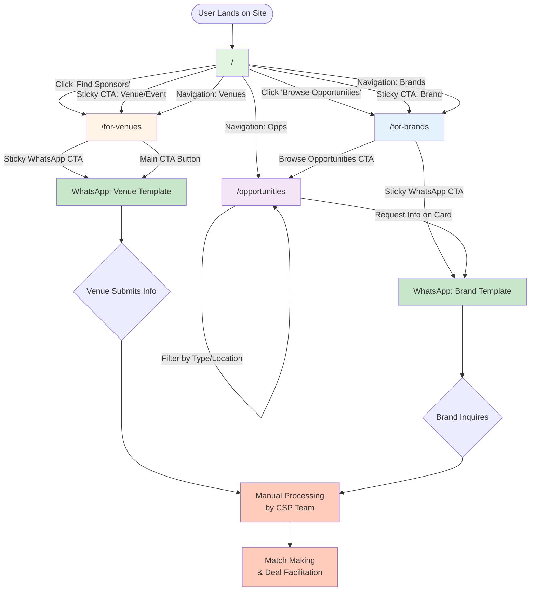
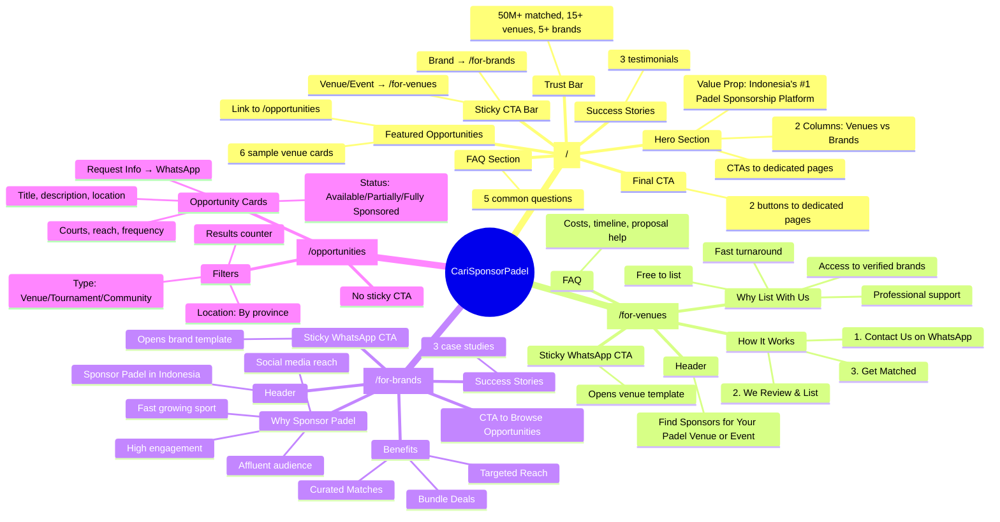
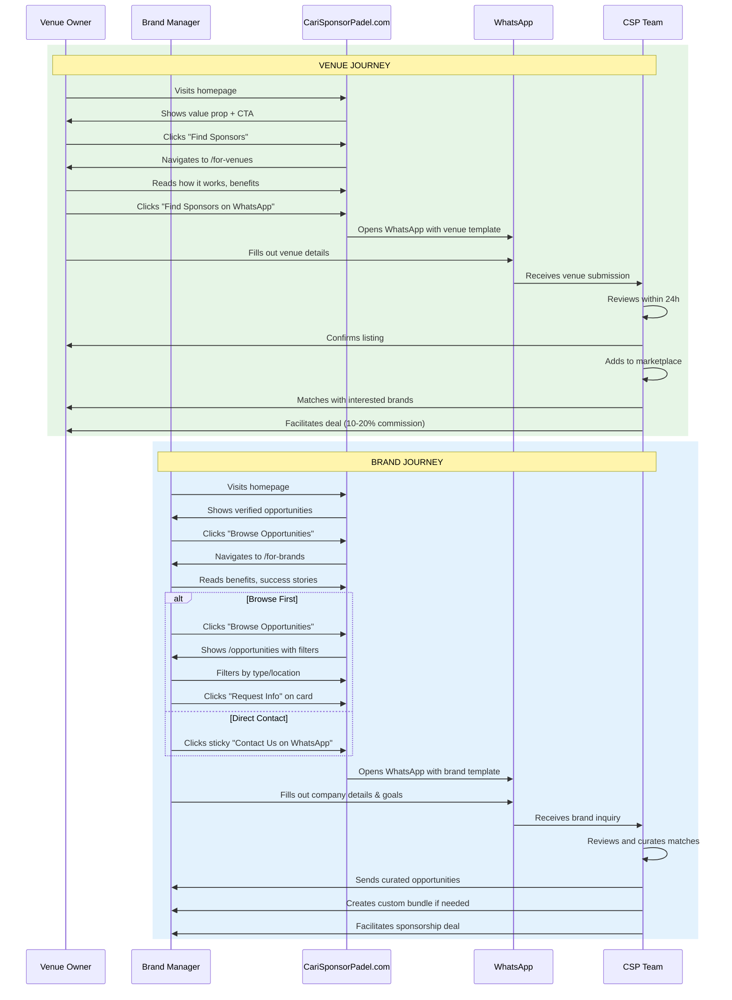
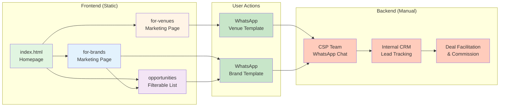
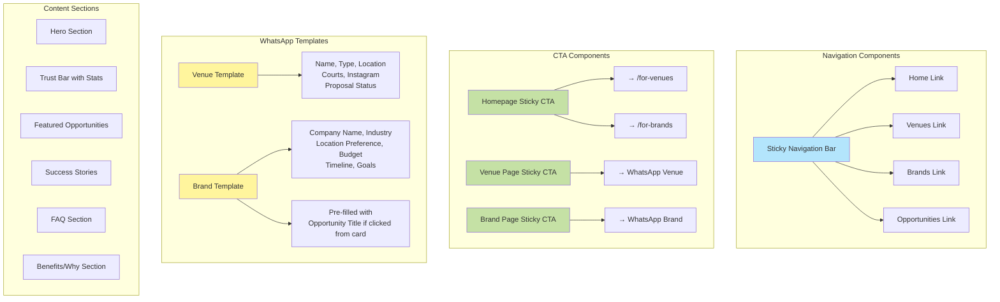
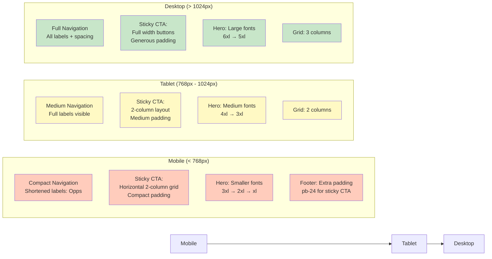

# CariSponsorPadel - Site Blueprint

## User Flow & Page Architecture



## Page Content Breakdown



## Customer Interaction Flow



## Data Flow Architecture



## Key Features & Components



## Responsive Design Strategy



## Conversion Funnel

```mermaid
graph TB
    Start([Visitor]) --> Homepage{Homepage<br/>First Impression}

    Homepage --> |"I have venue"| VenuePath[/for-venues Page]
    Homepage --> |"I'm a brand"| BrandPath[/for-brands Page]
    Homepage --> |"Just browsing"| Browse[/opportunities Page]

    VenuePath --> VenueEducated{Reads Benefits<br/>Understands Process}
    BrandPath --> BrandEducated{Reads Benefits<br/>Sees Success Stories}

    VenueEducated --> |"Convinced"| VenueWA[Opens WhatsApp<br/>Venue Template]
    BrandEducated --> |"Want to browse first"| Browse
    BrandEducated --> |"Ready to contact"| BrandWA[Opens WhatsApp<br/>Brand Template]

    Browse --> |"Found interesting opp"| BrandWA

    VenueWA --> VenueLead{Completes<br/>Template?}
    BrandWA --> BrandLead{Completes<br/>Template?}

    VenueLead --> |"Yes"| QualifiedVenue[Qualified Venue Lead]
    BrandLead --> |"Yes"| QualifiedBrand[Qualified Brand Lead]

    VenueLead --> |"No"| Lost1[Lost Lead]
    BrandLead --> |"No"| Lost2[Lost Lead]

    QualifiedVenue --> Processing[CSP Team Processing]
    QualifiedBrand --> Processing

    Processing --> Match[Successful Match]
    Processing --> NoMatch[No Match Yet]

    Match --> Deal[Deal Closed<br/>10-20% Commission]

    style Start fill:#e1f5e1
    style Homepage fill:#fff4e6
    style VenuePath fill:#e3f2fd
    style BrandPath fill:#e3f2fd
    style Browse fill:#f3e5f5
    style VenueWA fill:#c8e6c9
    style BrandWA fill:#c8e6c9
    style QualifiedVenue fill:#ffccbc
    style QualifiedBrand fill:#ffccbc
    style Deal fill:#4caf50
    style Lost1 fill:#ef5350
    style Lost2 fill:#ef5350
```

---

## Summary

### Pages (4 total)
1. **/** - Homepage (main landing, education, CTAs)
2. **/for-venues** - Venue marketing page with WhatsApp CTA
3. **/for-brands** - Brand marketing page with WhatsApp CTA
4. **/opportunities** - Filterable sponsorship opportunities list

### External Touchpoints
- **WhatsApp** - Primary conversion point with 2 templates
- **CSP Team** - Manual processing, matching, deal facilitation

### Key Conversion Points
1. Homepage → Dedicated pages (education)
2. Dedicated pages → WhatsApp (lead capture)
3. Opportunities page → WhatsApp (qualified interest)
4. WhatsApp → CSP Team (lead processing)

### Revenue Model
- **Free to list** for venues/events
- **10-20% commission** on closed deals
- **Optional**: 3M for professional proposals (free if deal closes in 60 days)
```
